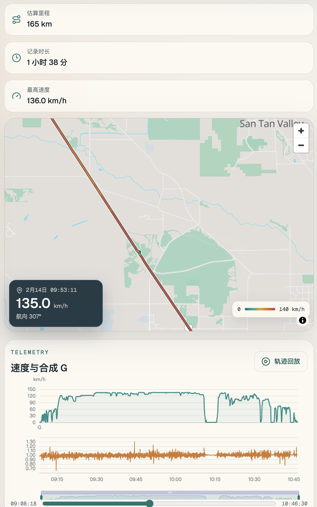
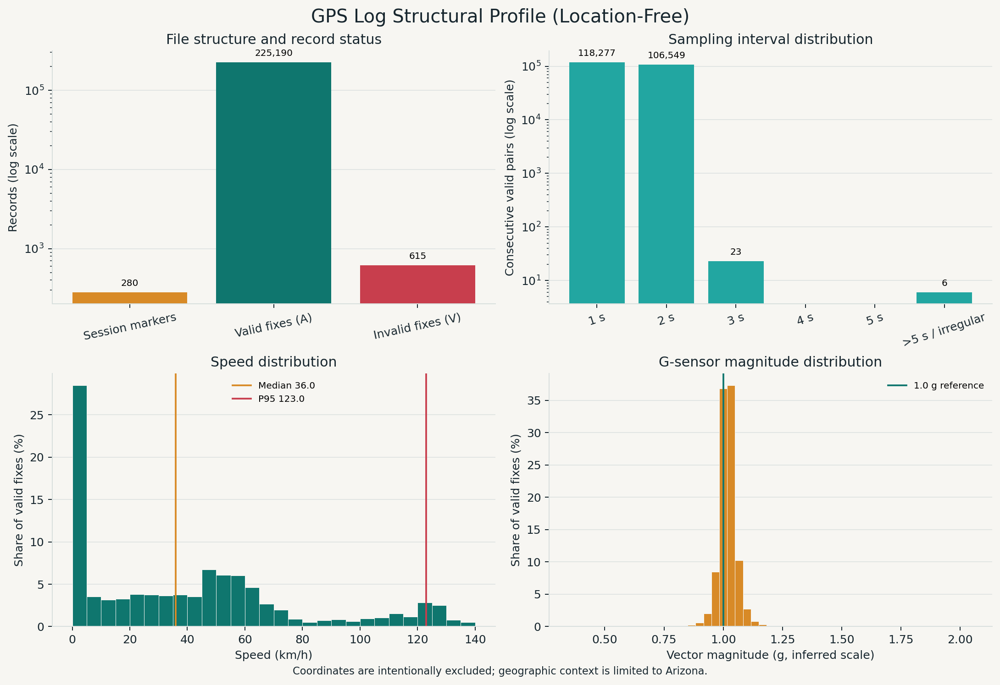

# GPS Log Visualizer

一个本地优先的 70mai GPS 日志浏览器。它把 `$V02` 日志块解析为独立行程，并在同一时间游标下联动显示路线、速度和合成 G 值。



## 使用

```bash
npm install
npm run ingest -- ../GPSData000001.txt
npm run dev
```

默认输入路径就是项目上一级的 `GPSData000001.txt`，因此当前数据可以直接运行 `npm run ingest` 重新生成。

轨迹浏览位于 `/`，整份日志的速度、里程和时间分布统计位于 `/stats`。

## GPS log 格式分析

日志是无表头的纯文本：每个 `$V02` 标记开启一个记录块，随后是若干逗号分隔的数据行。当前样本包含 280 个记录块和 225,805 行数据；所有数据行均为 13 列，其中 225,190 行状态为 `A`，615 行状态为 `V`。为保护隐私，下面不展示任何实际坐标。

```text
$V02
<raw_ts>,A,<latitude>,<longitude>,<heading_x100>,<speed_raw>,<gx>,<gy>,<gz>,NOYYYYMMDD-HHMMSS-xxxxxxF.MP4,0,0,0
```

| 列（从 1 开始） | 含义 | 解析方式 / 观察 |
| --- | --- | --- |
| 1 | 原始时间戳 | 类 Unix 秒值；`V` 行可能为 0，不能直接当标准 UTC 使用 |
| 2 | 定位状态 | `A` = 有效定位，`V` = 无效定位 / GPS 间断 |
| 3–4 | 纬度、经度 | 十进制度；仅在本地用于路线，不进入分析图 |
| 5 | 航向 | 原始范围 `0..35900`，除以 100 得到度数 |
| 6 | 速度 | 推断为 `0.01 m/s`，乘以 `0.036` 得到 km/h |
| 7–9 | 三轴 G-sensor | 推断缩放为 `0.01 g`；合成值为三轴向量模长除以 100 |
| 10 | 视频文件名 | `NOYYYYMMDD-HHMMSS-……F.MP4`，包含 Phoenix 墙上时间 |
| 11–13 | 保留字段 | 当前样本中始终为 `0`，语义未知 |

### 时间与采样特征

- 连续有效点几乎全部相隔 1 或 2 秒，说明记录频率约为 0.5–1 Hz；`V` 行及异常间隔必须切断轨迹。
- 原始时间戳按标准 Unix 时间显示时，比视频文件名代表的 Phoenix 实际时间快约 8 小时（猜测应该为UTC时间）。导入器以文件名为参考，当前校准结果为 `raw + 28,800 s`，同时保留原始值到 `rawT`。
- 文件中观察到少量约 `±604,800 s`（一周）的突跳。导入器将其标记为时间异常并维持会话内时间连续，但不会跨异常点连接地图折线。
- 速度中位数约为 36 km/h，定位点速度 P95 约为 123 km/h；G-sensor 合成模长集中在 1 g 附近，支持 `0.01 g` 缩放的推断，但这些单位尚未由厂商文档确认。



*Figure 1. Location-free distributions of record status, sampling interval, speed, and inferred G-sensor magnitude. Coordinates are intentionally excluded.*

可复现该图：

```bash
python scripts/analyze-gps-log.py ../GPSData000001.txt
```

## 解析与可视化规则

- `A` 记录用于轨迹和时间轴，`V` 记录保留为 GPS 间断。
- 航向按原始值除以 100 转成度。
- 速度按原始值乘以 0.036 转成 km/h。
- 第 7–9 列暂按原始三轴 G-sensor 展示，合成值按百分之一 g 计算。
- 原始 Unix 值不是标准 UTC 时间。解析器会用视频文件名中的 Phoenix 墙上时间估算整点偏移；当前日志校准结果为原始值加 8 小时，原始值仍保留在 `rawT`。
- 超过 5 秒的定位间隔、GPS 无效区间、异常空间跳跃和约一周的时间戳跳变都会切断地图折线。
- 地图同时绘制连续的轨迹概览线和按速度分段的彩色线，缩小地图时由概览线保持路线可见。
- 导入时会生成 `statistics.json`，预先聚合每 10 km/h 的里程与时长、每小时和每月里程，以及移动平均速度、夜间里程、最长记录等统计。
- 生成结果位于 `public/data`，按会话拆分以避免一次加载全部定位点。

## 隐私

日志和解析结果只在本地项目中处理。地图底图通过 Protomaps PMTiles 的 HTTP Range 请求读取 `https://build.protomaps.com/20260713.pmtiles`，字体和图标来自 Protomaps basemaps-assets；这些服务仍能看到浏览器请求了哪些地图数据范围。若需要完全离线，可下载区域 PMTiles 与配套字体、图标，并把样式地址替换为本地资源。
